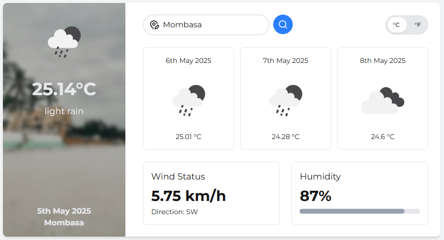

# Weather App

A decoupled weather application with a Next.js frontend and a Laravel API backend.

A working URL without Laravel configuration

[https://weather-app-two-alpha-73.vercel.app/](https://weather-app-two-alpha-73.vercel.app/)

## Project Structure

The application consists of two distinct parts:

1. **Frontend**: Next.js application with TypeScript and Tailwind CSS
2. **Backend**: Laravel API application

## Screenshots



## Frontend Setup

### Prerequisites

- Node.js 14+ and npm or yarn

### Installation

1. Clone the repository and navigate to the frontend directory:

   ```bash
   git clone <repo-url>
   cd frontend
   ```

2. Install dependencies:

   ```bash
   npm install
   # or
   yarn install
   ```

3. Create a `.env.local` file in the `frontend` folder and add the Laravel backend URL:

   ```env
   LARAVEL_API_URL=http://localhost:8000/api
   ```

4. Start the development server:

   ```bash
   npm run dev
   # or
   yarn dev
   ```

The app will be available at [http://localhost:3000](http://localhost:3000).

## Backend Setup

### Prerequisites

- PHP 8.0+
- Composer
- Laravel CLI

### Installation

1. Navigate to the backend directory:

   ```bash
   cd backend
   ```

2. Install Composer dependencies:

   ```bash
   composer install
   ```

3. Copy the environment file and generate an application key:

   ```bash
   cp .env.example .env
   php artisan key:generate
   ```

4. Add your OpenWeatherMap API key to the `.env` file:

   ```env
   OPENWEATHER_API_KEY=your_api_key_here
   ```

   You can obtain a free API key by registering at [OpenWeatherMap](https://openweathermap.org/api).

5. Start the Laravel development server:

   ```bash
   php artisan serve
   ```

The API will be available at [http://localhost:8000/api](http://localhost:8000/api).

## API Endpoints

### Get Weather Data

```
GET /api/weather
```

**Query Parameters:**

- `city` (required): Name of the city to fetch weather for
- `units` (optional): Measurement system (`metric` or `imperial`, default: `metric`)

**Sample Response:**

```json
{
  "data": {
    "cod": "200",
    "message": 0,
    "cnt": 40,
    "list": [
      {
        "dt": 1746381600,
        "main": {
          "temp": 16.8,
          "feels_like": 16.94,
          "temp_min": 16.8,
          "temp_max": 16.8,
          "pressure": 1015,
          "sea_level": 1015,
          "grnd_level": 838,
          "humidity": 92,
          "temp_kf": 0
        },
        "weather": [
          {
            "id": 500,
            "main": "Rain",
            "description": "light rain",
            "icon": "10n"
          }
        ],
        "clouds": {
          "all": 100
        },
        "wind": {
          "speed": 1.61,
          "deg": 46,
          "gust": 3.47
        },
        "visibility": 10000,
        "pop": 1,
        "rain": {
          "3h": 1.66
        },
        "sys": {
          "pod": "n"
        },
        "dt_txt": "2025-05-04 18:00:00"
      }
    ],
    "city": {
      "id": 184736,
      "name": "Nairobi South",
      "coord": {
        "lat": -1.3033,
        "lon": 36.8264
      },
      "country": "KE",
      "population": 0,
      "timezone": 10800,
      "sunrise": 1746329248,
      "sunset": 1746372683
    }
  },
  "city": "Nairobi"
}
```

## Features

- Search weather by city name
- Toggle between Celsius and Fahrenheit
- Display current weather with icon
- 3-day forecast overview
- Wind speed and humidity indicators

## Technologies Used

### Frontend

- Next.js
- TypeScript
- Tailwind CSS
- Lucide React (icons)

### Backend

- Laravel (latest)
- OpenWeatherMap API integration

## Development Notes

- Frontend and backend are fully decoupled
- Frontend communicates via RESTful API
- CORS is enabled on the backend to allow cross-origin requests
